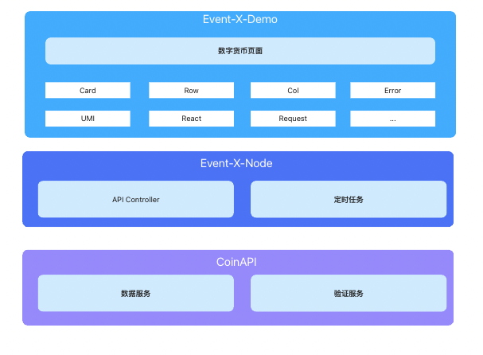
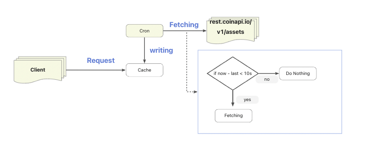

# Event-X-Demo

## 支持运行环境

> Node Version > 15.x.x && npm Vesion > 8.x.x

## 依赖安装和运行

项目整体管理依赖于 lerna，使用 lerna 命令去安装和启动项目

```
# 安装依赖
npm run install

# 启动
npm run start

# 打包
npm run build
```

## 技术选型

### 客户端

| Package | Version |
| ------- | ------- |
| React   | 17.x    |
| Umi     | ^3.5.35 |
| Umi     | ^6.5.0  |

### 服务端

| Package | Version |
| ------- | ------- |
| Nestjs  | 9.0.0   |

## 代码规范

```
module.exports = {
  parser: '@typescript-eslint/parser',
  parserOptions: {
    project: 'tsconfig.json',
    tsconfigRootDir : __dirname,
    sourceType: 'module',
  },
  plugins: ['@typescript-eslint/eslint-plugin'],
  extends: [
    'plugin:@typescript-eslint/recommended',
    'plugin:prettier/recommended',
  ],
  root: true,
  env: {
    node: true,
    jest: true,
  },
  ignorePatterns: ['.eslintrc.js'],
  rules: {
    '@typescript-eslint/interface-name-prefix': 'off',
    '@typescript-eslint/explicit-function-return-type': 'off',
    '@typescript-eslint/explicit-module-boundary-types': 'off',
    '@typescript-eslint/no-explicit-any': 'off',
  },
};
```

## 架构设计



### 如何降低 API 调用成本

目前应用存在这样一个特性，用户量大，但是用户获取的数据基本在同一时间是一致的，不会存在不同用户数据的不一致性。会导致 API 成本提升的原因会有两个。

1. 用户大量请求重复数据
2. 外部爬虫发送 API 请求导致

为了避免这种情况的发生，同时目前的接口数据存在一定的可重复利用性，所以从客户端接口访问的数据，都命中到服务端到缓存数据中。同时，服务端启用定时任务定时刷新缓存数据。



#### 数据刷新的条件

1. 距离最新请求的一分钟内。避免网站无人使用时请求 API 导致无效刷新。
2. 平均每 30s 请求刷新一次数据

#### 关于 Node 和客户端的交互

1. 如果需要动态的进行交互可以通过建立 webSocket 服务在数据更新是，更新到客户端
2. 用户手动刷新发送 HTTP 请求刷新页面
3. 客户端短轮询请求 API

## 测试
